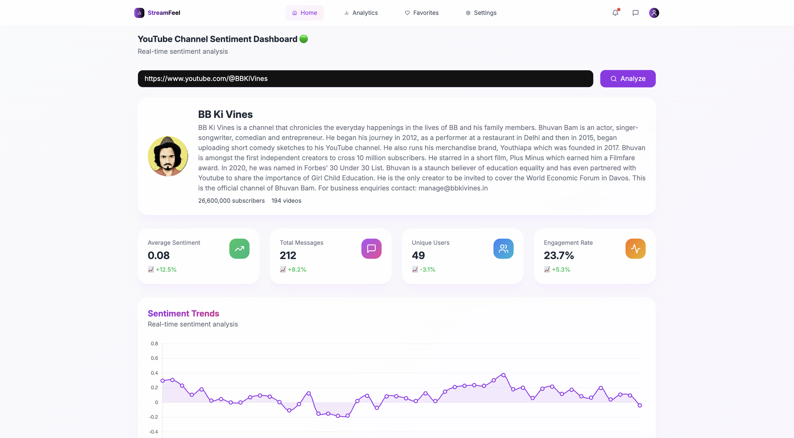

# 🌊 StreamFeel

> 🔥 Vibe check your social media feeds in real-time! No cap.

[](https://remix.run/)
[](https://tailwindcss.com/)
[](https://www.mongodb.com/)

## 👀 What's the Tea?

StreamFeel is your bestie for keeping tabs on social media vibes! Drop in any hashtag or keyword, and watch the sentiment unfold in real-time. Whether you're tracking your brand's reputation or just curious about what's trending, we've got you covered! 

### ✨ Features that Slap

- 🎯 **Real-Time Feels** - Watch those vibes roll in live
- 📊 **Aesthetic AF Charts** - Data visualization that doesn't bore you to death
- 🔌 **Platform Besties** - Slides into Twitter, YouTube, and Twitch's DMs
- 🎯 **Custom Tracking** - Your keywords, your rules
- 📚 **Time Machine** - Peek at past vibes whenever
- 🎨 **Clean UI** - Interface so smooth it butter

## 🚀 Tech Stack (The Cool Stuff)

### 🎨 Frontend Drip
```txt
💫 Remix (because we're fancy)
🎭 TailwindCSS (for that aesthetic)
📈 Chart.js/D3.js (making data look fire)
```

### 🛠 Backend Magic
```txt
⚡ Node.js + WebSocket (keeping it real-time)
🤝 Social Media API Integration
🧠 Python + Hugging Face (for the big brain energy)
🗄️ MongoDB (where the tea is stored)
```

## 💻 Get This Party Started

### 📝 Before You Pull Up
- Node.js + npm (the basics)
- Python 3.8+ (for the smart stuff)
- MongoDB account (free tier works!)
- API keys from your fav platforms

### 🔥 Setup Guide

1. **Yoink the Code**
   ```bash
   git clone https://github.com/your-username/streamfeel.git
   cd streamfeel
   ```

2. **Frontend Setup (The Pretty Part)**
   ```bash
   cd frontend
   npm install   # grab the goodies
   ```

3. **Backend Setup (The Brain Part)**
   ```bash
   cd backend
   npm install   # more goodies
   ```

4. **AI Magic Setup**
   ```bash
   cd sentiment-analysis
   pip install -r requirements.txt   # big brain time
   uvicorn app:app --reload   # let it rip
   ```

5. **Spill the Tea (Environment Setup)**
   ```env
   MONGO_URI=your-super-secret-mongo-uri
   API_KEY=your-special-api-key
   ```

6. **Fire It Up**
   ```bash
   # Terminal 1: Backend vibes
   cd backend && npm start

   # Terminal 2: Frontend magic
   cd frontend && npm run dev
   ```

## 📱 Screenshots

### Dashboard Drip
<div align="center">
  
  
</div>

<!-- ### Trend Watch
<div align="center">
  
</div> -->

## 🤝 Squad Up (How to Contribute)

Want to make StreamFeel even more fire? Here's how:

1. Fork it (yoink!)
2. Create your branch: `git checkout -b feature-name`
3. Commit your changes: `git commit -m "Added this fire feature"`
4. Push to the branch: `git push origin feature-name`
5. Drop that pull request! 🔥

## 📱 Slide into Our DMs

Got questions? We don't bite!

- 👤 **Name**: Ankur Kaushal
- 📧 **Email**: ankur.kaushal.21cse@bmu.edu.in
- 🐙 **GitHub**: [@Avenster](https://github.com/Avenster)

---

### 💫 No Cap, Just Facts
StreamFeel is the moment! Start tracking those vibes today and never miss a beat! 


[](https://github.com/Avenster/streamfeel)

---

Made with 💖 and ☕ by [@Avenster](https://github.com/Avenster)

